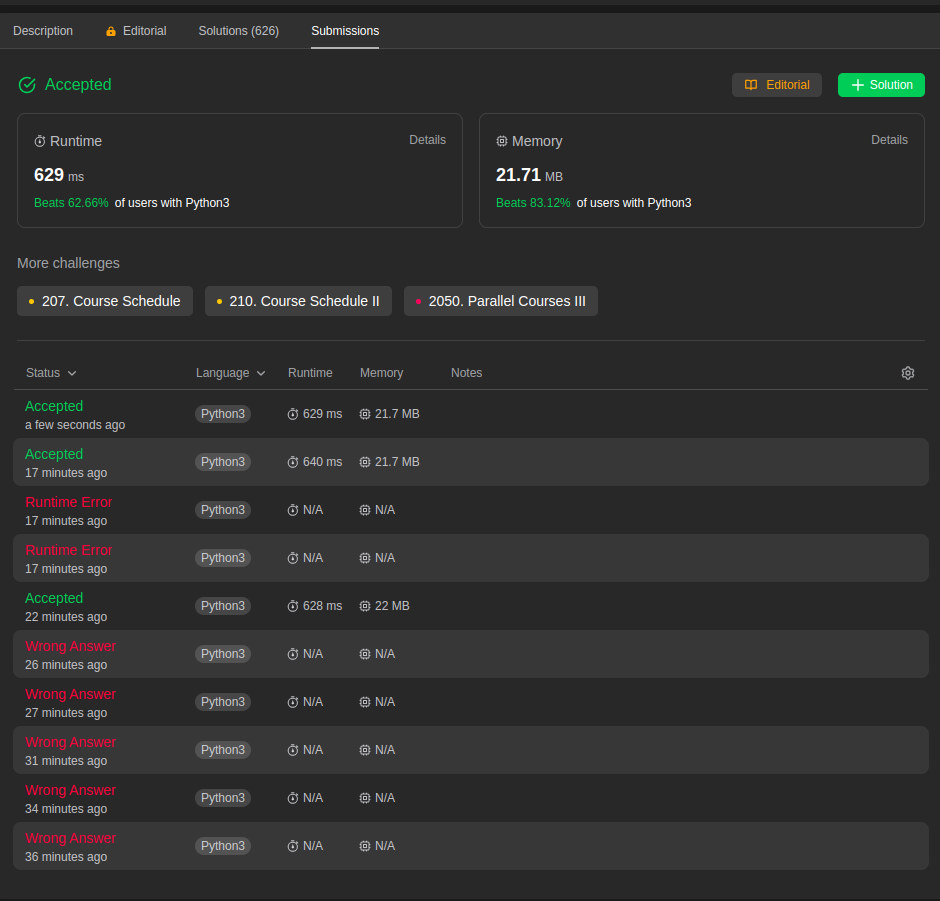
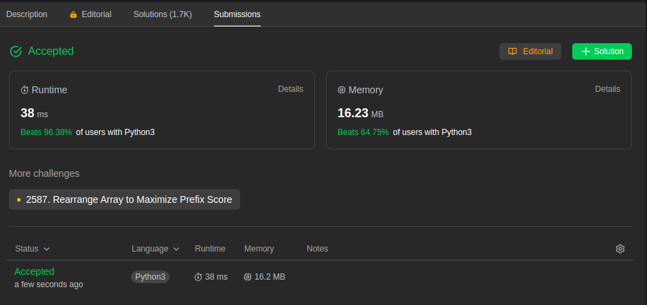
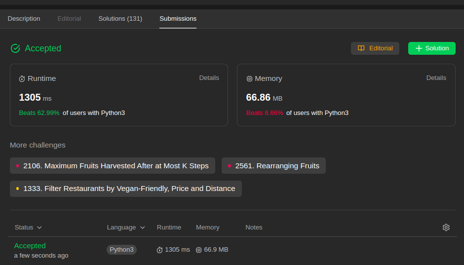

# Exercícios Resolvidos

**Número da Lista**: 1 
**Conteúdo da Disciplina**: Greed(Algoritmos Ambiciosos) 

## Alunos
|Matrícula | Aluno |
| -- | -- |
| 17/0140571  |  Douglas Farias de Castro |
| 17/0034941  |  Guilherme Peixoto Lima |

## Sobre 
Descreva os objetivos do seu projeto e como ele funciona. 

## Screenshots

### **Problema 2406**

### **Problema 435**

### **Problema 646**

### **Problema 630**

### **Problema 1029**

### **Problema 2412**

## Instalação 
**Linguagem**: C e Python3 

## Apresentação 
